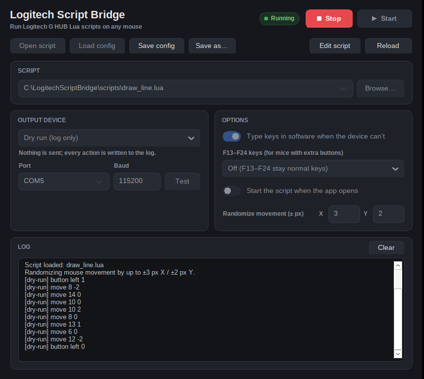
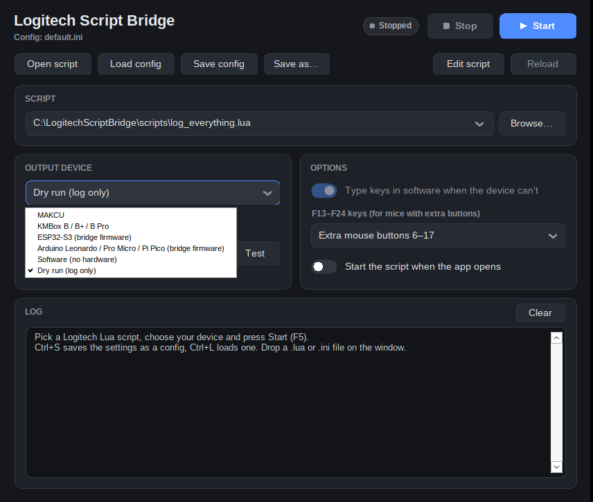

<p align="center">
  
</p>

<h1 align="center">Logitech Script Bridge</h1>

<p align="center">
  Run <b>Logitech G HUB / LGS Lua scripts</b> with <b>any mouse</b>, sending the output through a MAKCU, KMBox, ESP32-S3, Arduino or Raspberry Pi Pico.
  From a Windows PC, or from an <b>Android phone</b> plugged into a MAKCU.
</p>

<p align="center">
  <a href="https://github.com/Blake12609/logitech-script-bridge/releases/latest"></a>
  <a href="https://github.com/Blake12609/logitech-script-bridge/actions/workflows/build.yml"></a>
  
  
  
</p>

<p align="center">
  
</p>

## What it does

Logitech mice can run Lua scripts (rapid fire, macros, button remaps...) through
G HUB. This app runs those same scripts for everyone else:

1. It runs your `.lua` script with the same **G-series Lua API** as G HUB.
2. It watches your real mouse buttons and calls the script's `OnEvent` like G HUB does.
3. It sends the script's clicks, moves and key presses out through a **USB device**,
   which the PC sees as a real mouse and keyboard.

It's a **single portable `.exe`** of under 1 MB, written in C++ with Lua built in.
There's no installer, no .NET and no Python, and it has no dependencies beyond Windows itself.

## Download

Get the latest version from the **[Releases page](https://github.com/Blake12609/logitech-script-bridge/releases/latest)**:

| File | For |
|------|-----|
| `LogitechScriptBridge-x64.exe` | 64-bit Windows (almost every PC) |
| `LogitechScriptBridge-x86.exe` | 32-bit Windows |
| `LogitechScriptBridge-android.apk` | Android 8 or newer, see [Android app](#android-app) |
| `LogitechScriptBridge-vX.Y.Z.zip` | Both exes, example scripts, firmware and an empty `scripts\` + `configs\` folder |

Windows SmartScreen may warn because the exe isn't code-signed: click *More info* and then *Run anyway*.

## Supported hardware

| Output device | Mouse | Keyboard | Setup |
|---|:---:|:---:|---|
| **MAKCU** | ✅ | via software* | Plug in, pick its COM port |
| **KMBox B / B+ / B Pro** | ✅ | via software* | Plug in, pick its COM port |
| **ESP32-S3** | ✅ | ✅ | Flash [`firmware/esp32s3_bridge`](firmware/esp32s3_bridge) |
| **Raspberry Pi Pico / RP2040** | ✅ | ✅ | Flash [`firmware/arduino_hid_bridge`](firmware/arduino_hid_bridge) |
| **Arduino Leonardo / Micro / Pro Micro** | ✅ (no back/forward) | ✅ | Flash [`firmware/arduino_hid_bridge`](firmware/arduino_hid_bridge) |
| **Software** (Windows `SendInput`) | ✅ | ✅ | Nothing. Many games ignore injected input, so this is mainly for testing |
| **Dry run** | log only | log only | Nothing. Shows every action in the log instead of sending it |

\* These devices are mouse-only. By default the app types the script's key presses
with Windows `SendInput` instead. You can turn that off.

Any other device that speaks the MAKCU/KMBox `km.move(x,y)` / `km.left(1)` serial
protocol should work with the MAKCU or KMBox setting.

<p align="center"></p>

## Quick start

1. Download and run `LogitechScriptBridge-x64.exe`. Put it in its own folder: it saves its settings there.
2. **Open**: pick your `.lua` file (the same one you'd paste into G HUB). You can also drag it onto
   the window, keep your scripts in a `scripts\` folder next to the exe and pick them from **Scripts**,
   or press **New** in the Script tab and write one right in the app.
3. **Output device**: pick your hardware and its COM port (the ⌄ menu lists connected ports).
   Press **Test**: the mouse pointer should wiggle right and back.
4. Press **Start** (F5). Script output (`OutputLogMessage`) appears in the **Log** tab in white, app
   messages in grey and errors in red. Hover over any button to see its keyboard shortcut.

The window remembers its size and position.

### Edit scripts in the app

The **Script** tab is a built-in Lua editor, so you can tweak a script without leaving the app:

- **Syntax colouring** for Lua and the G HUB functions, plus **line numbers**.
- A **live syntax check** under the editor. A mistake shows up as *Line 13: unexpected symbol near '2'*
  and its line number turns red, before you ever press Start.
- **Enter** keeps the indent (and indents after `function`, `if`, `for`, `do`...), **Tab** inserts 4 spaces.
- **Save** (Ctrl+S while typing) writes the file. If the script is running it restarts with the new code
  straight away. **Start** saves unsaved changes first, and a script error jumps to the broken line.
- **New** starts from a template with an `OnEvent` ready to fill in, **Revert** throws away unsaved changes
  and **Expand** hides the other cards to give the editor the whole window.
- The Script tab shows a dot while there are unsaved changes, and the app asks before closing or opening
  another script so nothing is lost. The **Log** tab shows a dot when the script printed something new
  (red for errors).

Files keep their line endings (Windows or Unix) and are saved as UTF-8.

### Save and load configs

A config remembers the script, device, port and options. Click the config button in the title bar
(it shows the current config's name) for **Save** (Ctrl+S), **Save as…** (Ctrl+Shift+S) and **Load…** (Ctrl+L).
You can also drop a `.ini` file on the window. The dot on that button is green when saved and blue when
there are unsaved changes.
Configs go to a `configs\` folder next to the exe by default. Scripts stored next to them are
saved as relative paths, so you can move the whole folder or carry it on a USB stick.
The title bar shows `*` when the settings differ from the loaded config.

Turn on **Start the script when the app opens** and the app is ready to go as soon as you launch it.

### Start/stop hotkey

Pick a **Start/stop hotkey** (F6–F12, Pause or Scroll Lock) to start and stop the script from
anywhere, even while a game or Paint is in front. While it's set, that key is reserved for the app.

### Live mouse view

The **Mouse** card shows a mouse whose buttons light up while a script runs: filled means pressed on
your mouse, outlined means held by the script. It also shows which number (`OnEvent` arg) each
button has.

### Randomize movement

**Randomize (px)** takes a **Min** and **Max** distance in pixels (decimals allowed, e.g. 0.5 to 2.5).
Every mouse movement the script makes then lands between Min and Max pixels away from where
the script asked, in a random direction. That gives drawing scripts in Paint and similar apps a
hand-drawn look. The pointer wobbles around the path the script asked for and never drifts away from it,
even over long strokes. Set Max to 0 (the default) for exact movement.
Try [`examples/paint_draw_line.lua`](examples/paint_draw_line.lua) with Min 1, Max 4.

## Android app

The phone can be the brain instead of the PC: it runs the script and drives a MAKCU over a USB OTG cable.
The PC just sees a mouse and needs no software at all.

```
mouse ──► MAKCU ──► PC            the PC only sees a normal mouse
            ▲
            │ USB OTG (the MAKCU's COM port)
          phone running Script Bridge
```

1. Install `LogitechScriptBridge-android.apk` from the [Releases page](https://github.com/Blake12609/logitech-script-bridge/releases/latest).
   Android asks you to allow installing apps from your browser or file manager the first time.
2. Plug the MAKCU into the PC as usual and your mouse into the MAKCU. Then connect the MAKCU's **COM** port
   to the phone with a USB-C OTG cable or adapter. The app switches the MAKCU to 4 Mbaud by itself,
   like MAKCU's own software does. Android offers to open Script Bridge: tick *Always*
   and it connects by itself from then on (or press **Connect**).
3. Pick a script: **Open** a `.lua` file, choose one under **Scripts** (the examples are built in) or
   write a **New** one. Press **Start**.

What it does:

- **Your real mouse buttons trigger the script.** The app reads them through the MAKCU (`km.buttons`),
  so side-button scripts behave as they do on a Logitech mouse. The buttons light up on the Mouse card.
- **On-screen buttons**: hold any button of the mouse picture (1–5) or G1–G6 to trigger the script.
  Handy for testing, and for devices that can't report the mouse's buttons.
- **Editor** with the same syntax colouring, line numbers, auto-indent and live syntax check as the
  PC app, plus a row of keys that are awkward on a phone keyboard (`( ) " = ~= end then`…). Saving a
  running script restarts it with the new code.
- **Keeps running with the screen off**; a notification shows the script and has a Stop button.
- **Randomize movement** works as on the PC.

| Device | On the phone |
|---|---|
| **MAKCU** | Mouse output, and your real mouse buttons trigger the script |
| **KMBox B / B+ / B Pro** | Mouse output; trigger the script with the on-screen buttons |
| **ESP32-S3** (bridge firmware) | Mouse + keyboard. Phone into the board's **COM/UART** port, native USB port into the PC |
| **Demo** | No hardware: every action is written to the log |

What a phone can't do: it can't see the PC's keyboard or pointer. `IsModifierPressed` and
`IsKeyLockOn` always return false. For `MoveMouseTo` and `GetMousePosition` you enter the PC's
screen size under Options; `MoveMouseTo` first pushes the pointer into the top-left corner and
counts from there (exact only with *Enhance pointer precision* turned off in Windows).
MAKCU and KMBox can't type keys; use an ESP32-S3 for that. There's no iPhone version because iOS
doesn't let apps talk to USB serial devices.

## How scripts behave (same as G HUB)

- `OnEvent(event, arg, family)` receives `PROFILE_ACTIVATED`, `PROFILE_DEACTIVATED`,
  `MOUSE_BUTTON_PRESSED` / `MOUSE_BUTTON_RELEASED` and `G_PRESSED` / `G_RELEASED`.
- Events are handled one at a time on a single script thread, so the usual
  `repeat ... Sleep(10) until not IsMouseButtonPressed(5)` loops work unchanged.
- Left click events are only reported after `EnablePrimaryMouseButtonEvents(true)`.
- Button numbers follow Logitech's convention:

  | Button  | `OnEvent` arg | `PressMouseButton` / `IsMouseButtonPressed` |
  |---------|:---:|:---:|
  | Left    | 1 | 1 |
  | Right   | 2 | 3 |
  | Middle  | 3 | 2 |
  | Back    | 4 | 4 |
  | Forward | 5 | 5 |

- Clicks sent by the script come back to the PC like real clicks. The app
  recognises them and does not feed them back into `OnEvent`.
- **Stop** (Shift+F5) interrupts a running handler, even a `while true do end` loop.
  It gives the script up to 1 second of `PROFILE_DEACTIVATED`, then releases every
  button and key the script still held. **Reload** (Ctrl+R) restarts the script after you edit it.
- `Sleep()` has 1 ms resolution.

### Supported API

`OutputLogMessage`, `OutputDebugMessage`, `ClearLog`, `Sleep`, `GetRunningTime`, `GetDate`,
`PressKey`, `ReleaseKey`, `PressAndReleaseKey`, `IsModifierPressed`, `IsKeyLockOn`,
`PressMouseButton`, `ReleaseMouseButton`, `PressAndReleaseMouseButton`, `IsMouseButtonPressed`,
`MoveMouseRelative`, `MoveMouseWheel`, `MoveMouseTo`, `MoveMouseToVirtual`, `GetMousePosition`,
`EnablePrimaryMouseButtonEvents`, `GetMKeyState`, `SetMKeyState`.

Keys can be given as names (`"lshift"`, `"a"`, `"f5"`, `"spacebar"`) or scancodes (`0x1E`).
Scripts run on Lua 5.4, with the Lua 5.1 names older scripts expect (`unpack`, `loadstring`,
`math.pow`) still available.

These do nothing because there is no Logitech hardware to drive:
`OutputLCDMessage`, `ClearLCD`, `SetBacklightColor`, `PlayMacro`/`PressMacro`/`AbortMacro`
(G HUB macros live in G HUB, not in the script), and the DPI functions.

As in G HUB, scripts run in a sandbox: `io`, `os.execute`, `require`, `debug` and
precompiled bytecode are not available.

## Flashing the firmware

Both firmwares make the board a USB mouse and keyboard that takes commands over its USB serial port.

**ESP32-S3**: open [`firmware/esp32s3_bridge/esp32s3_bridge.ino`](firmware/esp32s3_bridge/esp32s3_bridge.ino) in the Arduino IDE
with the ESP32 board package. Choose board **ESP32S3 Dev Module**, *USB Mode: USB-OTG (TinyUSB)* and
*USB CDC On Boot: Enabled*, then upload. Plug the board's native **USB** port (not *COM/UART*) into the PC.
For the Android app, plug the phone into the board's **COM/UART** port: the firmware takes the same
commands there (115200 baud).

**Arduino Leonardo / Micro / Pro Micro / Raspberry Pi Pico**: open
[`firmware/arduino_hid_bridge/arduino_hid_bridge.ino`](firmware/arduino_hid_bridge/arduino_hid_bridge.ino),
pick your board and upload. For the Pico, install Earle Philhower's *Raspberry Pi Pico/RP2040* core.
The stock AVR Mouse library only has three buttons, so back/forward clicks need an RP2040 board.

Serial protocol (one command per line, `\r\n`), the same commands as MAKCU plus keyboard:

```
km.move(x,y)   km.wheel(n)   km.left(1|0)   km.right(1|0)   km.middle(1|0)
km.side1(1|0)  km.side2(1|0) kb.down(hid)   kb.up(hid)      km.version()
```

## How it's tested

The tests run on every push, on Windows (64-bit and 32-bit) and Linux:

- **Engine**: G HUB behaviour against scripted input, including button numbering, hold loops,
  Stop inside endless loops, releasing held input, the sandbox, extra buttons and G-keys.
- **Wire format**: the exact bytes written to a serial port, checked through a virtual port.
- **Firmware, end to end**: both sketches are compiled against a stand-in Arduino library.
  A Lua script runs in the real engine, its commands are fed into the firmware, and the test
  checks the USB mouse and keyboard actions that come out.
- **Configs**: save/load round trips, relative paths and hand-edited files.
- **Phone**: the MAKCU button stream parser (including button masks that look like line breaks),
  scripts driven by the stream and by on-screen buttons, `MoveMouseTo` from the corner, and the
  JNI layer driven from Java with `-Xcheck:jni`. The APK is built on every run.

The Windows GUI has been exercised under Wine. The Android app is built and its engine is tested,
but it has not been run on a phone yet. **None of the devices has been tested on
physical hardware yet.** If you try one, please open an issue saying whether it worked.

## Limitations

- Windows 10 and 11. Windows 7 and 8.1 should work but haven't been tested.
- `MoveMouseTo` is approximate: hardware mice only move relatively, so the app
  steers toward the target (pointer acceleration can make it land a few pixels off).
- Extra buttons beyond five need the F13–F24 workaround described above.

Game and anti-cheat rules apply to your scripts as they would with a Logitech mouse.
Check the rules of whatever you use this with.

## Building

Needs CMake 3.16+ and a C++17 compiler. Lua 5.4 is vendored in `third_party/lua`.

```bat
:: Visual Studio (Developer Command Prompt); use -A Win32 for the 32-bit build
cmake -S . -B build -A x64
cmake --build build --config Release
ctest --test-dir build -C Release
```

```bash
# MinGW-w64 cross-compile from Linux (64-bit / 32-bit)
cmake -S . -B build-win   -DCMAKE_TOOLCHAIN_FILE=cmake/mingw-w64.cmake      && cmake --build build-win
cmake -S . -B build-win32 -DCMAKE_TOOLCHAIN_FILE=cmake/mingw-w64-i686.cmake && cmake --build build-win32

# tests on Linux/macOS
cmake -S . -B build && cmake --build build && ctest --test-dir build
```

The Android app is in `android/` (Kotlin + Jetpack Compose, with the same C++ engine through the NDK).
Open that folder in Android Studio, or run `./gradlew assembleRelease` there with the Android SDK and NDK installed.
Release APKs are signed with `android/app/release.jks`, so a new version installs over the old one.
In a fork, add your own key as the secrets `ANDROID_KEYSTORE_B64` (the keystore, base64),
`ANDROID_KEYSTORE_PASSWORD`, `ANDROID_KEY_ALIAS` and `ANDROID_KEY_PASSWORD`.

To publish a release, open **Actions → build → Run workflow** and enter a version (e.g. `v1.2.0`), or push a `v*` tag.

```
src/
  engine.cpp       Lua runtime + G-series API, event queue, stop handling
  backend.cpp      devices, MAKCU/KMBox km.* protocol, dry run
  serial.cpp       serial ports (Win32 + POSIX)
  config.cpp       config files, portable relative paths
  keys.cpp         key names <-> scancodes <-> HID usage IDs
  platform_win.cpp mouse/keyboard hooks, keyboard state, SendInput output
  gui_win.cpp      the window
  mobile_session.cpp  the phone version: MAKCU button stream, pointer tracking
android/               the Android app (Kotlin UI, JNI glue in app/src/main/cpp)
firmware/
  esp32s3_bridge/      ESP32-S3 sketch
  arduino_hid_bridge/  Leonardo / Pro Micro / Pi Pico sketch
examples/              sample scripts
tests/                 engine, config, serial, phone and firmware tests
```

## License

MIT, see [LICENSE](LICENSE). Lua is © Lua.org, PUC-Rio, under the MIT license ([third_party/lua/LICENSE](third_party/lua/LICENSE)).
